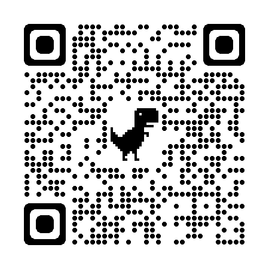
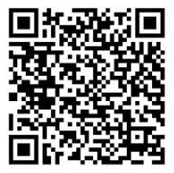

# Sharing Contact Information - QR Codes, NFC Tags, vCards, Online Resumes

Once you've created a resume, what next? This page describes different ways to share contact and other information.

## QR Codes

QR stands for "Quick Response". QR codes are increasingly used as a quick way to provide a link to more information (such as your contact details or resume). Here's some information on QR codes and how to make them.

* The Story of the QR Code (4 minutes) - https://www.youtube.com/watch?v=k09ip9Z6TCk
* Create QR Codes for FREE (7 minutes) - https://www.youtube.com/watch?v=GadmYWAVnjE
* Create a QR Code in Chrome browser: Chrome browser - shift-right-click in webpage - Create QR Code for this page - [The QR Code image will download.]

## NFC Tags

NFC stands for "Near Field Communication". NFC tags are also increasingly used as a quick way to provide a link to more information. Here's some information on NFC tags, how to use them with your phone, and how to program them.

* What is an NFC Tag? (2 minutes) - https://www.youtube.com/watch?v=9AqDn3sMVDA
* How To Use NFC Tags With Your iPhone (9 minutes) - https://www.youtube.com/watch?v=IrfWmDwWdS4
* How to Make Your Own Digital Business Cards - NFC Tag Tutorial (4 minutes) - https://www.youtube.com/watch?v=1-m4BkCWmtE

## vCards

vCards or VCF files are a way to share contact information electronically. VCF stands for "Virtual Card Format". Here is some information on VCF files.

* What is a VCF file? (webpage) https://docs.fileformat.com/email/vcf/
* How to Create a vCard in Outlook (1 minute) - https://www.youtube.com/watch?v=rLMqYRyGAEw
* Create .vcf file from Google Contacts: Google Contacts - select contact - Export - vCard - [your .vcf file will download]
* How to Edit VCF file on Windows 10 (webpage) https://techcult.com/how-to-edit-vcf-file/

## Online Resumes

There are a number of ways you can share your contact details and resume online. Here are some examples.

### Post a pdf of your resume on GitHub

GitHub will display pdf files online. You can create a new repository, upload a pdf of your resume, and provide the link. Here's a link to a pdf file on this repository: https://github.com/cmcntsh/SharingContactInformationQrNfcVcardResume/blob/main/4b644f8e9658d02af62f7bca2800fecc-Function-resume-template.pdf

### Create a resume on GitHub using markdown

* The Markdown Resume https://mszep.github.io/pandoc_resume/
* https://blog.chmd.fr/editing-a-cv-in-markdown-with-pandoc.html
* markdown-cv https://elipapa.github.io/markdown-cv/
* Markdown Resume Template https://github.com/aonemd/markdown-resume-template
* The Simplest Markdown Resume Workflow http://sdsawtelle.github.io/blog/output/simple-markdown-resume-with-pandoc-and-wkhtmltopdf.html

### Host your resume and contact details using GitHub Pages

Using GitHub Pages to host your resume and contact details increases the possibilities of what you can do. GitHub Pages needs to be turned on for your repsitory for the examples below to work. This is done in the settings.

* Example online resume (Coding demo here: https://www.youtube.com/watch?v=sVp6KrFeKNI) - https://cmcntsh.github.io/SharingContactInformationQrNfcVcardResume/index1.html
* Share link to online resume using QR code (created with Chrome browser): 
* Share link to online resume using QR code (created with Google Sheets): 

